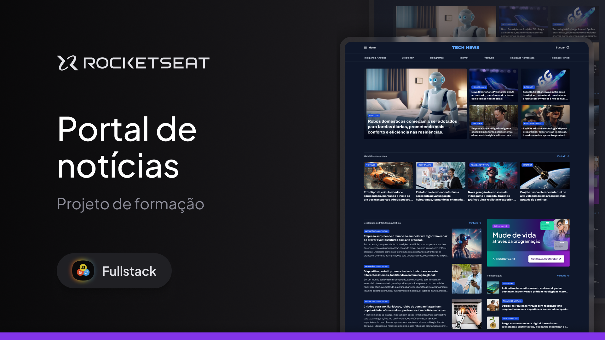
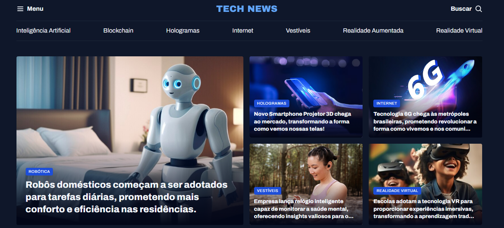

<h1 align="center"> Tech News </h1>

  Projeto desenvolvido com o curso Fullstack da Rocketseat.  
  <strong>Neste projeto o objetivo principal e trabalhar os conceitos de GRID no CSS.</strong>

  <a href="#-tecnologias">Tecnologias</a>&nbsp;&nbsp;&nbsp;|&nbsp;&nbsp;&nbsp;
  <a href="#-projeto">Projeto</a>&nbsp;&nbsp;&nbsp;|&nbsp;&nbsp;&nbsp;
  <a href="#-layout">Layout</a>&nbsp;&nbsp;&nbsp;&nbsp;&nbsp;&nbsp;

 

  
  
  

## 🚀 Tecnologias

Esse projeto foi desenvolvido com as seguintes tecnologias:

- HTML e CSS
- Git e Github
- Figma

## 💻 Projeto

Esta página traz notícias sobre o mundo da tecnologia.

---

Feito com ♥ by May
